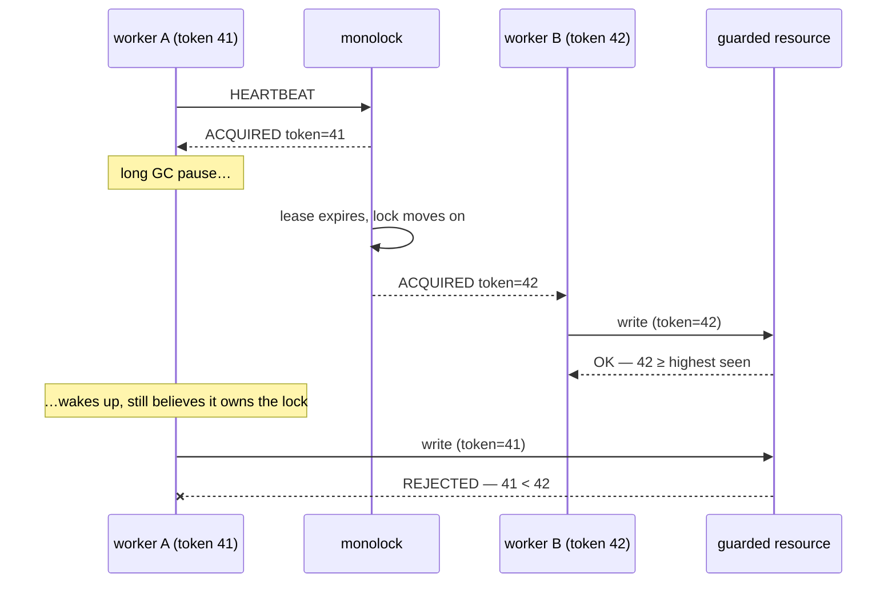

When a connection is lost, the server moves the lock. This gives *liveness*:
the lock never stays behind a dead holder for more than the lease. But this
does not give *safety*. A GC cycle, a closed laptop lid, or a network problem
can pause a holder. The holder can then continue and write to the guarded
resource **after** its lease expired and the lock moved. For a window of
time, two processes both think that they hold the lock. No limit that the
server controls bounds this window.

The server cannot close this window. The server manages the lock, not the
resource, and it cannot recall a write that is already in flight. No lock
service can do this. This is a property of distributed mutual exclusion, not
a monolock limitation. What a lock service *can* do is give the resource the
information that the resource needs to protect itself.

## The token

Each grant of each lock gets a **fencing token**: a `uint64` that is strictly
larger than the token of each earlier grant. The token comes in `ACQUIRED`.
Each `ACQUIRED` that a session receives — the first grant, a promotion, a
heartbeat acknowledgement — contains the same token that the session got at
its grant.

Send the token with each operation on the guarded resource — a conditional
write, a CAS, an `if token >= stored_token` check. The resource must reject
each operation that carries a smaller number than the largest number that the
resource has seen.

The stale holder fences *itself* out: each message that it sends carries an
older token than the token of the current owner. The resource needs only one
comparison and one stored number — no clocks, and no round-trip to the lock
service.

## Using it in practice

Put the check at the location where the write occurs:

- **SQL**: store the token adjacent to the guarded row(s) and make each write
  conditional — `UPDATE … SET …, token = $t WHERE token <= $t`.
- **Object storage**: put the token in the object metadata and use
  compare-and-swap / preconditions (ETag-style) with the token as the key.
- **Your own service**: keep `max_seen_token` for each guarded entity, and
  reject requests that carry a smaller token.

Tokens strictly increase across *all* locks, not for each lock. One global
counter issues them. Thus a comparison of tokens is meaningful for one
guarded resource, and the correct design is one lock for one guarded
resource.

The [Go client](/clients/go/) gives the token to your work function as an
argument. A raw-protocol client reads the token from each `ACQUIRED` frame
(see the [wire protocol](/reference/protocol/)).

## The guarantee's bounds

The server makes the token from its start time and a global grant counter.
Nothing is persisted to disk. Thus the bounds of the guarantee are explicit:
tokens continue to increase across a server restart **only if** the clock of
the server does not go back between the restarts, and if there is a minimum
of one second between the restarts.

For a single-node server with no consensus and no disk, this is a deliberate
trade-off. This page states the trade-off and does not hide it. If the
resource demands stronger guarantees than this, a consensus-backed lock
service is necessary instead — see
[what monolock is not](/start/introduction/#what-monolock-is-not).
