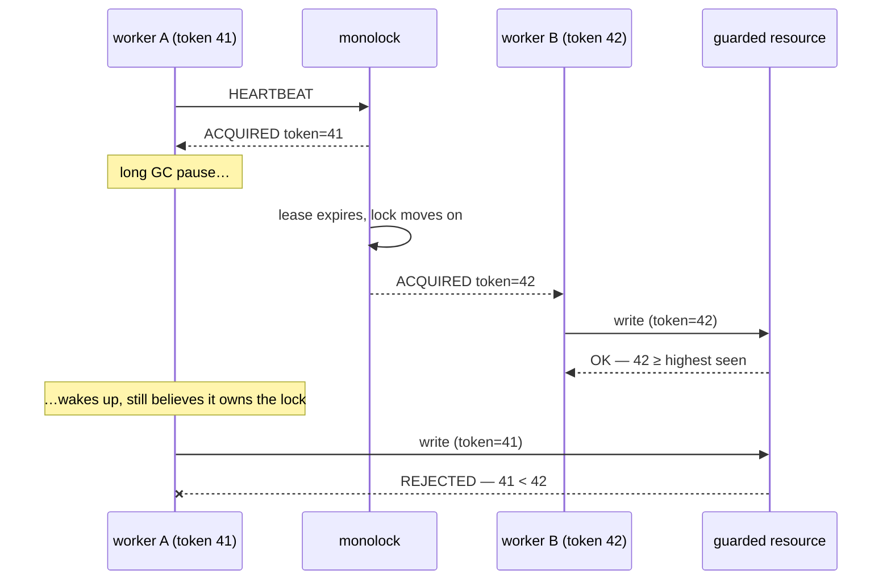

Losing a connection and handing the lock over gives *liveness* — the lock
never sits behind a dead holder for longer than the lease — but not *safety*.
A holder paused by a GC cycle, a laptop lid, or a network hiccup may wake up
and write to the guarded resource **after** its lease expired and the lock
moved on. For a window bounded by nothing the server controls, two processes
both believe they hold the lock.

The server cannot close that window. It manages the lock, not the resource,
and it cannot recall a write that is already in flight. No lock service can —
this is a property of distributed mutual exclusion, not a monolock
limitation. What a lock service *can* do is give the resource the information
it needs to protect itself.

## The token

Every grant of any lock gets a **fencing token**: a `uint64` strictly larger
than the token of every earlier grant, delivered in `ACQUIRED`. Every
`ACQUIRED` a session receives — the first grant, a promotion, a heartbeat
acknowledgement — carries the same token the session was granted.

Pass the token along with every operation against the guarded resource — a
conditional write, a CAS, an `if token >= stored_token` check — and have the
resource reject anything carrying a smaller number than the largest it has
seen.

The stale holder fences *itself* out: whatever it sends is stamped with an
older token than the current owner's. The resource needs one comparison and
one remembered number — no clocks, no lock-service round-trip.

## Using it in practice

The check belongs wherever the write lands:

- **SQL**: store the token next to the guarded row(s) and make every write
  conditional — `UPDATE … SET …, token = $t WHERE token <= $t`.
- **Object storage**: put the token in the object metadata and use
  compare-and-swap / preconditions (ETag-style) keyed on it.
- **Your own service**: keep `max_seen_token` per guarded entity, reject
  requests carrying less.

Tokens are strictly increasing across *all* locks, not per lock — they are
issued from one global counter. Comparing tokens is therefore meaningful for
one guarded resource, and one resource should be guarded by one lock.

The [Go client](/clients/go/) hands the token to your work function as an
argument; a raw-protocol client reads it from every `ACQUIRED` frame (see the
[wire protocol](/reference/protocol/)).

## The guarantee's bounds

The token is built from the server's start time and a global grant counter,
with nothing persisted to disk. That makes the guarantee's bounds explicit:
tokens keep growing across a server restart **as long as** the server's clock
does not step backwards and restarts happen at most once per second.

For a single-node server with no consensus and no disk this is a deliberate
trade-off, stated rather than hidden. If the resource demands stronger
guarantees than that, it needs a consensus-backed lock service instead —
see [what monolock is not](/start/introduction/#what-monolock-is-not).
