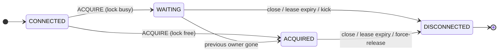

One client owns a named lock and does the work; the others queue up in FIFO
order. On graceful shutdown the next client takes over immediately. If a
client hangs or the network drops, the lock moves on once the session stays
silent for a full lease. This page unpacks each part of that sentence.

## Sessions

A **session** is one TCP connection making one claim on one named lock. The
first message on a connection must be `ACQUIRE`, naming the lock and choosing
a lease; from then on the connection's life *is* the claim's life:



`ACQUIRED` never falls back to `WAITING`: once you own a lock, you own it
until your session ends. A second `ACQUIRE` on the same connection is a
protocol error. There is no `RELEASE` command — closing the connection is the
release, and the next waiter is promoted at once, with no need to wait out the
lease.

This design removes a whole class of client bugs. There is no release call to
forget, no session identifier to persist and lose, and no way to accidentally
hold a lock without an open connection backing it. If the process dies, the
kernel closes the socket, and the lock moves on.

## The lease is a sliding window of silence

The lease is **not** a fixed term after which the lock changes hands. It is a
failure detector: the server remembers when it last heard from a session
(`lastSeenAt`), and every heartbeat resets that countdown to the full lease.
As long as heartbeats keep arriving, a lock can be held forever; the lease
only decides how quickly a *dead* holder is detected.

Each client chooses its own lease in `ACQUIRE`, per connection. There is no
server-side lease knob and no upper bound — how long a lock is held is
unlimited anyway, so bounding the lease would bound nothing. Pick the smallest
value that survives the network pauses between you and the server:
milliseconds on the same machine, seconds across a flaky WAN.

Only durations cross the wire, never timestamps, so clocks need no
synchronisation, and both sides use monotonic time exclusively — a wall-clock
step on either machine changes nothing.

## Heartbeats

The client derives its whole heartbeat schedule from the lease it chose:

```
baseInterval  = lease / 4
clientTimeout = lease * 0.8      // always fires before the server lease
safeRTT       = smoothedRTT * 2  // EWMA, alpha = 0.2
interval      = clamp(baseInterval - safeRTT, minHeartbeatInterval, baseInterval)
```

Four beats per lease means a single lost or delayed heartbeat does not kill
the session. The RTT correction only ever *shrinks* the interval — a slow link
makes the client beat sooner to compensate for time spent in flight, while a
fast link never pushes the interval above `baseInterval`.

The client also gives up on its own at `0.8 × lease` without a confirmation —
*before* the server's lease expires. The ordering is the point: a holder never
believes in a lock the server has already moved on from. The pessimistic side
of the race is always the client, which is the safe side to be pessimistic on.

At most one heartbeat is ever in flight. Heartbeats therefore cannot pile up
in a TCP buffer, a stale message cannot extend a session, and no sequence
numbers are needed. Replies double as acknowledgements: the server answers a
heartbeat with the session's current state (`WAITING` or `ACQUIRED`), so one
round-trip confirms the heartbeat arrived, the session is still registered,
and the return path works.

## The queue and the handover

Waiters queue per lock in strict FIFO order, and they heartbeat exactly like
holders — a waiter that goes silent for its lease loses its place. When the
owner's session ends, the head of the queue is promoted and the server sends
it `ACQUIRED` **on its own initiative**, without waiting for the waiter's next
heartbeat. Clients keep a permanent reader on the connection for exactly this
reason: promotion is a push, not a poll, so handover latency is one one-way
trip, not a heartbeat interval.

How fast the handover happens depends on how the previous owner went away:

| Owner's exit | Handover latency | Why |
| ------------ | ---------------- | --- |
| Graceful (connection closed) | immediate | close *is* the release |
| Force-released by an [admin](/operations/admin-api/) | immediate | the server closes the owner's session itself |
| Process killed, socket reset by the OS | immediate | TCP RST reaches the server |
| Hang, GC pause, network partition | ≤ the owner's lease | the server must wait out the silence |
| Slow reader/writer (stuck socket) | ≤ `io-timeout` per operation | a blocked write to the session fails and ends it |

The last row is the server's only I/O policy: a single read or write on a
connection is bounded by [`-io-timeout`](/operations/configuration/) (default
5s), so one stuck client cannot wedge a server goroutine.

## Ownership ends, work must stop

When a session loses its lock — lease expiry, force-release, server
shutdown — the *lock* side is handled: the next waiter is promoted, with a
larger fencing token. The *work* side is the client's job: whatever the lock
guarded must stop. The [Go client](/clients/go/) cancels the work function's
context the moment ownership stops being confirmed; a client you write
yourself must do the same (see
[Writing a client](/clients/writing-a-client/)).

Between "the server moved on" and "the stale holder noticed", the guarded
resource is the last line of defense — that is what
[fencing tokens](/concepts/fencing-tokens/) are for.

## Shutdown

On graceful server shutdown every session is told the server is going away
(`ERROR` code `0x01`) and connections close. That error is classified as a
*server condition*: nothing is wrong with the client, so the right reaction is
to reconnect immediately — against the restarted server or its replacement —
and re-queue. The [ops endpoints](/operations/observability/) outlive the
protocol listener, so health probes and metric scrapes keep working through
the whole shutdown window.
