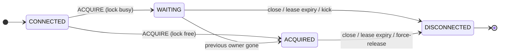

import { Aside } from '@astrojs/starlight/components';

One client owns a named lock and does the work. The other clients wait in a
FIFO queue. After a controlled shutdown, the subsequent client takes the lock
immediately. If a client stops or the network fails, the session becomes
silent. When the session is silent for a full lease, the server moves the
lock. This page explains each part of this model.

## Sessions

A **session** is one TCP connection that makes one claim on one named lock.
The first message on a connection must be `ACQUIRE`. This message gives the
name of the lock and selects a lease. From this point, the life of the
connection *is* the life of the claim:



`ACQUIRED` never goes back to `WAITING`. When you own a lock, you own it
until your session ends. A second `ACQUIRE` on the same connection is a
protocol error. There is no `RELEASE` command. The close of the connection is
the release. The server immediately promotes the subsequent waiter. It is not
necessary to wait for the lease.

This design removes a full class of client bugs. There is no release call
that you can forget. There is no session identifier that you must keep and
can lose. It is not possible to hold a lock without an open connection behind
it. If the process stops, the kernel closes the socket, and the server moves
the lock.

## The lease is a sliding window of silence

<Aside type="note" title="A failure detector, not a deadline">
  The lease is **not** a fixed period after which the lock changes hands.
  The lease is a failure detector. The server records when it last received
  a message from a session (`lastSeenAt`). Each heartbeat starts this
  countdown again at the full lease. While heartbeats continue to arrive, a
  client can hold a lock without a time limit. The lease only controls how
  quickly the server detects a *dead* holder.
</Aside>

Each client selects its own lease in `ACQUIRE`, for its own connection. There
is no server-side lease setting and no upper limit. The hold time of a lock
is unlimited, thus a limit on the lease would limit nothing. Select the
smallest value that is larger than the network pauses between you and the
server: milliseconds on the same machine, seconds across an unreliable WAN.

Only durations go across the network, never timestamps. Thus clock
synchronisation is not necessary. The two sides use only monotonic time. A
wall-clock step on one of the machines has no effect.

## Heartbeats

The client calculates its full heartbeat schedule from the lease that it
selected:

```
baseInterval  = lease / 4
clientTimeout = lease * 0.8      // always fires before the server lease
safeRTT       = smoothedRTT * 2  // EWMA, alpha = 0.2
interval      = clamp(baseInterval - safeRTT, minHeartbeatInterval, baseInterval)
```

Four beats in each lease means that one lost or delayed heartbeat does not
stop the session. The RTT correction only makes the interval *smaller*. On a
slow link, the client sends its heartbeat sooner, to compensate for the time
in flight. On a fast link, the interval never goes above `baseInterval`.

The client also stops on its own at `0.8 × lease` if it gets no
confirmation. This occurs *before* the lease expires on the server. This
sequence is the important property: a holder never thinks that it holds a
lock that the server already gave to a different client. The client is always
the pessimistic side of the race. This is the safe side for pessimism.

A maximum of one heartbeat is in flight at one time. Thus heartbeats cannot
collect in a TCP buffer, an old message cannot extend a session, and sequence
numbers are not necessary. Each reply is also an acknowledgement: the server
answers a heartbeat with the current state of the session (`WAITING` or
`ACQUIRED`). Thus one round-trip confirms that the heartbeat arrived, that
the session is registered, and that the return path operates.

## The queue and the handover

Waiters wait in a strict FIFO queue for each lock. They send heartbeats
exactly like holders. A waiter that is silent for its lease loses its
position. When the session of the owner ends, the server promotes the head of
the queue and sends it `ACQUIRED` **on its own initiative**. The server does
not wait for the subsequent heartbeat of the waiter. For exactly this reason,
clients keep a permanent reader on the connection. Promotion is a push, not a
poll. Thus the handover latency is one one-way trip, not a heartbeat
interval.

The speed of the handover depends on how the previous owner went away:

| Owner's exit | Handover latency | Why |
| ------------ | ---------------- | --- |
| Controlled stop (connection closed) | immediate | the close *is* the release |
| Force-released by an [admin](/operations/admin-api/) | immediate | the server itself closes the session of the owner |
| Process killed, socket reset by the OS | immediate | the TCP RST reaches the server |
| Hang, GC pause, network partition | ≤ the owner's lease | the server must wait for the full lease of silence |
| Slow reader/writer (stuck socket) | ≤ `io-timeout` per operation | a blocked write to the session fails and ends the session |

The last row is the only I/O policy of the server. One read or one write on a
connection has the time limit [`-io-timeout`](/operations/configuration/)
(default 5s). Thus one stuck client cannot block a server goroutine.

## Ownership ends, work must stop

A session can lose its lock because of lease expiry, a force-release, or a
server shutdown. The server then completes the *lock* side: it promotes the
subsequent waiter, with a larger fencing token. The *work* side is the task
of the client: the work that the lock guarded must stop. The
[Go client](/clients/go/) cancels the context of the work function
immediately when the confirmation of ownership stops. A client that you
write yourself must do the same (see
[Writing a client](/clients/writing-a-client/)).

There is a window between two events: the server moves the lock, and the
stale holder detects the loss. In this window, only the guarded resource can
protect itself. This is the function of
[fencing tokens](/concepts/fencing-tokens/).

## Shutdown

During a controlled server shutdown, the server tells every session that the
server goes away (`ERROR` code `0x01`), and the connections close. This
error has the classification *server condition*: the client has no problem.
Thus the correct reaction is an immediate reconnection — to the restarted
server or to its [replacement](/operations/high-availability/) — and a new
position in the queue. The
[ops endpoints](/operations/observability/) stay open for more time than the
protocol listener. Thus health probes and metric collection continue through
the full shutdown window.
