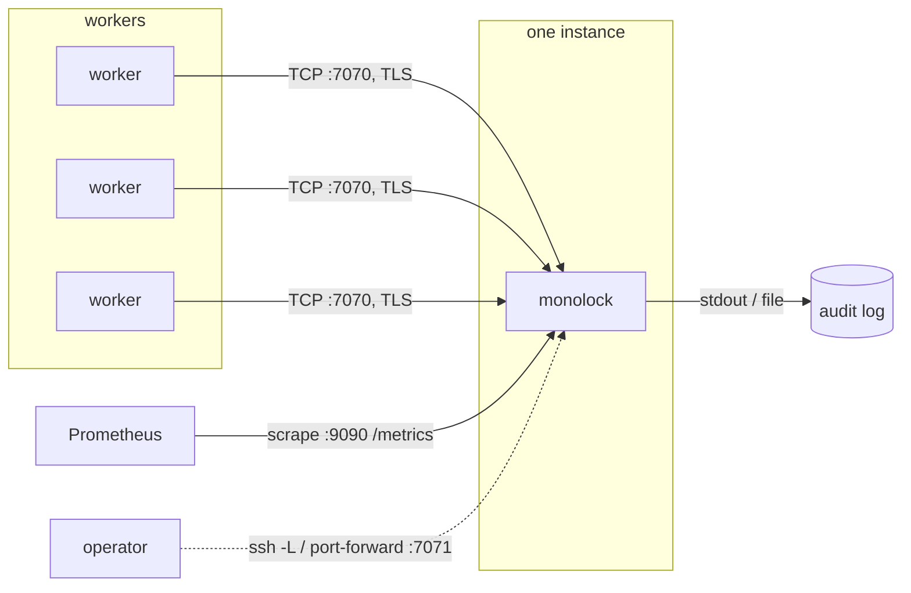

monolock is a single process with no state on disk, so deploying it is mostly
about three things: file descriptors ([capacity](/concepts/capacity/)),
signal delivery (`SIGHUP` reloads, graceful shutdown), and keeping exactly
one instance reachable at a stable address.



**One instance is the model, not a limitation to engineer around.** monolock
is a single point of coordination by design — do not run two instances behind
one load balancer, because locks live in one server's memory and two servers
are two independent lock spaces. Run one, restart it fast, and let clients
reconnect: on shutdown they are told to ([error `0x01`](/reference/errors/)),
and a restart loses only queue positions, while the guarded resources stay
protected by [fencing tokens](/concepts/fencing-tokens/).

## Docker

```sh
docker run -d --name monolock \
  -p 7070:7070 -p 9090:9090 \
  --ulimit nofile=1048576:1048576 \
  -v /etc/monolock:/etc/monolock:ro \
  -e MONOLOCK_OPS_LISTEN_ADDRESS=0.0.0.0:9090 \
  -e MONOLOCK_TLS_CERT=/etc/monolock/server.crt \
  -e MONOLOCK_TLS_KEY=/etc/monolock/server.key \
  -e MONOLOCK_AUDIT_LOG=- \
  ghcr.io/monolock-dev/monolock
```

`--ulimit nofile=` is the connection capacity. `MONOLOCK_AUDIT_LOG=-` sends
the audit stream to stdout for the container log pipeline, while diagnostics
stay on stderr — the [two-log model](/operations/observability/#logging)
keeps them separable.

Reload certificates or the ACL file with:

```sh
docker kill --signal=HUP monolock
```

## systemd

```ini
[Unit]
Description=monolock — named lock server
After=network-online.target
Wants=network-online.target

[Service]
ExecStart=/usr/local/bin/monolock \
    -ops-listen 0.0.0.0:9090 \
    -admin-listen 127.0.0.1:7071 \
    -tls-cert /etc/monolock/server.crt \
    -tls-key /etc/monolock/server.key \
    -audit-log /var/log/monolock/audit.jsonl \
    -log-format json
ExecReload=/bin/kill -HUP $MAINPID
Restart=always
RestartSec=1
LimitNOFILE=1048576
User=monolock
DynamicUser=yes
LogsDirectory=monolock
NoNewPrivileges=yes
ProtectSystem=strict
ReadWritePaths=/var/log/monolock

[Install]
WantedBy=multi-user.target
```

`systemctl reload monolock` maps to `SIGHUP` — certificate rotation, ACL
reload and audit reopen. `LimitNOFILE=` sets the capacity. The hardening
options are safe because the server needs nothing from the filesystem beyond
its config files (read) and the audit log (write).

## Kubernetes

One replica, `Recreate` strategy — two pods during a rolling update would be
two independent lock spaces, so trade a few seconds of coordination gap for
correctness:

```yaml
apiVersion: apps/v1
kind: Deployment
metadata:
  name: monolock
spec:
  replicas: 1
  strategy:
    type: Recreate
  selector:
    matchLabels: { app: monolock }
  template:
    metadata:
      labels: { app: monolock }
    spec:
      containers:
        - name: monolock
          image: ghcr.io/monolock-dev/monolock
          ports:
            - { name: protocol, containerPort: 7070 }
            - { name: ops, containerPort: 9090 }
            - { name: admin, containerPort: 7071 }
          env:
            - { name: MONOLOCK_OPS_LISTEN_ADDRESS, value: "0.0.0.0:9090" }
            - { name: MONOLOCK_ADMIN_LISTEN_ADDRESS, value: "127.0.0.1:7071" }
            - { name: MONOLOCK_AUDIT_LOG, value: "-" }
            - { name: MONOLOCK_LOG_FORMAT, value: "json" }
          readinessProbe:
            httpGet: { path: /readyz, port: ops }
          livenessProbe:
            httpGet: { path: /healthz, port: ops }
---
apiVersion: v1
kind: Service
metadata:
  name: monolock
spec:
  selector: { app: monolock }
  ports:
    - { name: protocol, port: 7070 }
```

Clients connect to `monolock:7070`. The probes hit the
[ops server](/operations/observability/), which keeps answering through the
shutdown window, so the endpoint is pulled out of the Service before
connections are cut. The admin API stays on `127.0.0.1` — reach it with
`kubectl port-forward deploy/monolock 7071:7071`.

For TLS, mount the certificate Secret and point the `MONOLOCK_TLS_*`
variables at it; on rotation send the reload signal instead of restarting:

```sh
kubectl exec deploy/monolock -- kill -HUP 1
```

## Choosing leases around restarts

A server restart drops all sessions; clients that classify errors correctly
reconnect immediately (shutdown is a [server-condition
code](/reference/errors/)) and re-queue. The visible cost of a restart is
therefore roughly your image pull + process start, and it is worth measuring:
clients whose lease is far below that window will report acquisition failures
during the restart rather than riding it out, which is correct behavior —
just be sure their [retry policy](/clients/go/#errors) expects it.
