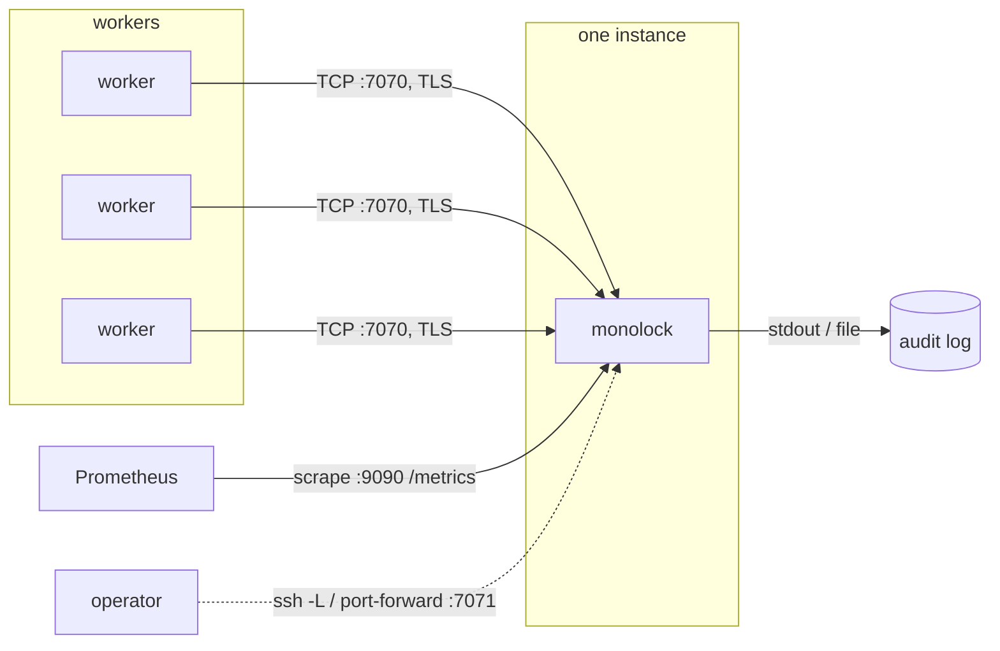

import { Aside } from '@astrojs/starlight/components';

monolock is a single process without state on disk. Thus a deployment has
three primary parts: file descriptors ([capacity](/concepts/capacity/)),
signal delivery (`SIGHUP` reloads and a controlled stop), and exactly one
instance that clients can reach at a stable address.



<Aside type="danger" title="One instance is the design, not a limitation">
  monolock is a single point of coordination by design. Do not operate two
  instances behind one load balancer. Locks are in the memory of one
  server, and two servers are two independent lock spaces.
</Aside>

Operate one instance, restart it quickly, and let the clients connect
again. At shutdown, the server tells the clients to connect again
([error `0x01`](/reference/errors/)). A restart loses only the queue
positions. The [fencing tokens](/concepts/fencing-tokens/) continue to
protect the guarded resources.

A passive standby behind a failover address is a different pattern, and it
is safe: only one instance receives traffic at each moment. See
[High availability](/operations/high-availability/).

## Docker

```sh
docker run -d --name monolock \
  -p 7070:7070 -p 9090:9090 \
  --ulimit nofile=1048576:1048576 \
  -v /etc/monolock:/etc/monolock:ro \
  -e MONOLOCK_OPS_LISTEN_ADDRESS=0.0.0.0:9090 \
  -e MONOLOCK_TLS_CERT=/etc/monolock/server.crt \
  -e MONOLOCK_TLS_KEY=/etc/monolock/server.key \
  -e MONOLOCK_AUDIT_LOG=- \
  ghcr.io/monolock-dev/monolock
```

`--ulimit nofile=` is the connection capacity. `MONOLOCK_AUDIT_LOG=-` sends
the audit stream to stdout for the container log pipeline. The diagnostics
stay on stderr. The [two-log model](/operations/observability/#logging)
keeps the two streams separable.

To read the certificates or the access-control list (ACL) file again, use:

```sh
docker kill --signal=HUP monolock
```

## systemd

```ini
[Unit]
Description=monolock — named lock server
After=network-online.target
Wants=network-online.target

[Service]
ExecStart=/usr/local/bin/monolock \
    -ops-listen 0.0.0.0:9090 \
    -admin-listen 127.0.0.1:7071 \
    -tls-cert /etc/monolock/server.crt \
    -tls-key /etc/monolock/server.key \
    -audit-log /var/log/monolock/audit.jsonl \
    -log-format json
ExecReload=/bin/kill -HUP $MAINPID
Restart=always
RestartSec=1
LimitNOFILE=1048576
User=monolock
DynamicUser=yes
LogsDirectory=monolock
NoNewPrivileges=yes
ProtectSystem=strict
ReadWritePaths=/var/log/monolock

[Install]
WantedBy=multi-user.target
```

`systemctl reload monolock` sends `SIGHUP`. This does the certificate
rotation, the ACL reload, and the audit reopen. `LimitNOFILE=` sets the
capacity. The hardening options are safe. The server needs only its
configuration files (read) and the audit log (write) from the filesystem.

## Kubernetes

Use one replica and the `Recreate` strategy. Two pods during a rolling
update are two independent lock spaces. Thus accept a coordination gap of
some seconds and get correct operation:

```yaml
apiVersion: apps/v1
kind: Deployment
metadata:
  name: monolock
spec:
  replicas: 1
  strategy:
    type: Recreate
  selector:
    matchLabels: { app: monolock }
  template:
    metadata:
      labels: { app: monolock }
    spec:
      containers:
        - name: monolock
          image: ghcr.io/monolock-dev/monolock
          ports:
            - { name: protocol, containerPort: 7070 }
            - { name: ops, containerPort: 9090 }
            - { name: admin, containerPort: 7071 }
          env:
            - { name: MONOLOCK_OPS_LISTEN_ADDRESS, value: "0.0.0.0:9090" }
            - { name: MONOLOCK_ADMIN_LISTEN_ADDRESS, value: "127.0.0.1:7071" }
            - { name: MONOLOCK_AUDIT_LOG, value: "-" }
            - { name: MONOLOCK_LOG_FORMAT, value: "json" }
          readinessProbe:
            httpGet: { path: /readyz, port: ops }
          livenessProbe:
            httpGet: { path: /healthz, port: ops }
---
apiVersion: v1
kind: Service
metadata:
  name: monolock
spec:
  selector: { app: monolock }
  ports:
    - { name: protocol, port: 7070 }
```

Clients connect to `monolock:7070`. The probes go to the
[ops server](/operations/observability/). This server continues to answer
during the shutdown window. Thus Kubernetes removes the endpoint from the
Service before the server closes the connections. The admin API stays on
`127.0.0.1`. Get access to it with
`kubectl port-forward deploy/monolock 7071:7071`.

For TLS, mount the certificate Secret and set the `MONOLOCK_TLS_*`
variables to its path. For a rotation, send the reload signal and do not
restart:

```sh
kubectl exec deploy/monolock -- kill -HUP 1
```

## Lease selection and restarts

A server restart stops all sessions. Clients that classify errors correctly
connect again immediately (shutdown is a [server-condition
code](/reference/errors/)) and go into the queue again. Thus the visible
cost of a restart is approximately the image pull plus the process start.
Measure this time. Clients that have a lease much shorter than this window
will report acquisition failures during the restart. They will not wait
through the restart. This behavior is correct. But make sure that their
[retry policy](/clients/go/#errors) is prepared for these failures.
