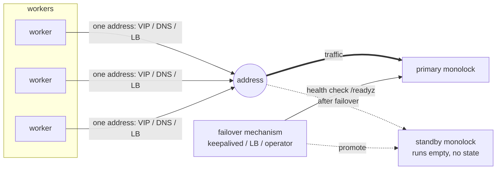

import { Aside } from '@astrojs/starlight/components';

monolock does not replicate, and [deployment](/operations/deployment/) is
one instance. But a second, passive instance can make the recovery from a
machine failure fast. The pattern: two identical servers, one address, and
a failover mechanism. The standby receives no state. A failover moves the
traffic, the state is lost, and the clients acquire their locks again. The
correctness comes from the leases and the
[fencing tokens](/concepts/fencing-tokens/), not from synchronisation
between the servers.

A standby is a fast restart on different hardware. A restart of one server
loses the queue positions and keeps the guarantees
([restarts](/operations/deployment/#lease-selection-and-restarts)). A
failover to a standby loses and keeps exactly the same. The standby only
makes the "restart" possible when the machine itself is gone.



## The pattern

- Two identical monolock instances on two machines, with the same
  [configuration](/operations/configuration/), certificates, and ACL.
- One address. Clients know only this address. At each moment, the address
  points to exactly one instance.
- A failover mechanism watches the primary through
  [`/readyz`](/operations/observability/) and moves the address when the
  primary fails.
- No replication and no connection between the two instances. The standby
  holds no locks and knows nothing about the primary.
- NTP on the two machines. This is the only requirement that connects them.

The failover procedure has one hard rule: **fence the old primary**. Take
the address away from it, or stop its process. The old server must not
keep its client sessions (see [split-brain](#split-brain) below). Then
send the traffic to the standby.

<Aside type="caution" title="Do not balance">
  Do not balance the traffic across the two instances. Two active
  instances are two independent lock spaces
  ([deployment](/operations/deployment/)). The standby is passive: it is
  running, and it waits.
</Aside>

## The failover timeline

The lease is `L`, and the detection-plus-switch time of your failover
mechanism is `D`:

| Time | Event |
| --- | --- |
| `t = 0` | The primary fails. The client sessions break, or they become silent. |
| `t ≤ 0.8 × L` | Each holder stops its own work. A client [abandons its claim](/concepts/how-it-works/#heartbeats) after `0.8 × lease` without a confirmation. |
| `t = D` | The health check fails, and the mechanism moves the address to the standby. |
| `t > D` | The clients connect again, acquire again, and the queues form again in the new arrival sequence. |

The service gap is approximately `D`. For the work under a lock, the gap
is up to `0.8 × L` plus the reconnection. Clients with a lease much
shorter than `D` report acquisition failures during the gap. This behavior
is correct, and their [retry policy](/clients/go/#errors) must be prepared
for it — the same preparation as for a
[restart](/operations/deployment/#lease-selection-and-restarts).

## Why this is correct without replication

### Mutual exclusion holds

The new server knows nothing about the old locks. It can grant a name that
the old primary also granted, before the old holder detects the loss. This
window is not new. It is the same stale-holder window as after a crash of
a single server, and the same rules bound it: the old holder abandons its
claim after `0.8 × lease` of silence, and in the window before that, only
the guarded resource can protect itself — with
[fencing tokens](/concepts/fencing-tokens/). A failover adds no new
failure mode.

### Fencing tokens stay monotonic

The server makes each token from the unix second of the *latest grant* and
a counter, and persists nothing ([the guarantee's
bounds](/concepts/fencing-tokens/#the-guarantees-bounds)). The epoch moves
forward with each grant. Thus a token is approximately the time of its
grant. The first grant of the new server comes after the detection and the
switch — more than one second after the last grant of the old primary.
Thus each token of the new server is larger than each token of the old
server — **only if** the clock of the new machine is not behind the clock
of the old machine. This is the function of the NTP requirement. The age
of the standby process has no effect: a standby that runs for months gives
correct tokens from its first grant.

### Split-brain

The failure can be a network flap, and the old primary can stay alive
after the traffic moves. Two protections apply:

- **The fence.** When the failover takes the VIP away, the old sessions
  break, the old holders see silence, and they abandon their claims. A
  DNS or load-balancer switch does *not* break established connections to
  a live server. Then the fence must stop the old process. Without the
  fence, the old holders continue their heartbeats to the old server and
  never see silence.
- **The tokens.** Each write from a stale holder carries a smaller token
  than the token of the new owner. The guarded resource rejects it with
  one comparison.

## What a failover loses

- **The queues.** The FIFO sequence forms again in the sequence of the
  reconnections. The old sequence is gone.
- **The ownership.** Each holder loses its lock and stops its work for up
  to `0.8 × L` plus the switch time.

This is the price of zero consensus. High availability here means that
the service returns quickly. It does not mean that the state continues
through a failure. If the state must continue, you need a
consensus-backed lock service
([what monolock is not](/start/introduction/#what-monolock-is-not)).

## keepalived example

Two machines, one VIP. The `BACKUP` node takes the VIP when the primary
fails its health check:

```text
# /etc/keepalived/keepalived.conf
vrrp_script monolock_ready {
    script "/usr/bin/curl -sf http://127.0.0.1:9090/readyz"
    interval 1
    fall 2
    rise 2
}

vrrp_instance monolock {
    state BACKUP
    interface eth0
    virtual_router_id 51
    priority 100            # a larger value on the preferred node
    nopreempt
    advert_int 1
    virtual_ipaddress {
        10.0.0.10/24
    }
    track_script {
        monolock_ready
    }
}
```

The VIP movement is the fence: the old node loses the address, and the old
sessions break.

`nopreempt` prevents an automatic failback. Each switch loses the full
state. Thus when the old node returns, do not switch back automatically.
A failback is a second failover: do it in a controlled window, or not at
all.

## Load balancer and DNS

A load balancer with an active/backup pool also operates: one backend
receives the traffic, the other is the backup.

<Aside type="caution" title="Two cautions">
  - The pool must never balance. Two active backends are two lock spaces.
  - The switch must break the connections to the old server. Many load
    balancers keep established connections to a live backend. DNS failover
    always keeps them. In these setups, the failover procedure must stop
    the old process — this is the fence. With DNS, the TTL also adds to
    `D`.
</Aside>

## Kubernetes

The [one-replica Deployment](/operations/deployment/#kubernetes) is
already this pattern. The Service is the stable address, the reschedule of
the pod is the failover, and the new pod continues the token sequence. A
second instance is not necessary. The detection time of a node
failure (the node controller plus the eviction timeout) is your `D`.

## Requirements

| Requirement | Reason |
| --- | --- |
| NTP on the two machines | the clock of the new server must not be behind the clock of the old server — the token sequence depends on it |
| The failover fences the old primary | live sessions on an unreachable-by-address server never become silent |
| One active instance at each moment | two active instances are two independent lock spaces |
| Clients classify [error `0x01`](/reference/errors/) and connect again | the reconnection after the switch is the normal shutdown path |
| The retry policy accepts failures for the time `D` | clients with a short lease do not wait through the gap |
