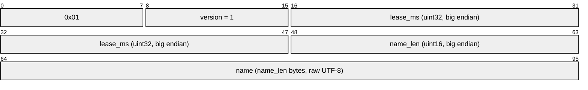
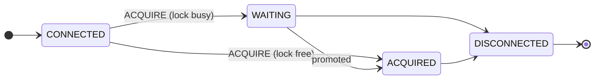

monolock speaks a binary protocol over raw TCP, version 1. One connection is
one claim on one named lock: the connection *is* the lease, closing it
releases the lock. All multi-byte integers are **big endian**. TCP is a byte
stream, so fixed-size fields are read fully (`io.ReadFull` in Go terms) —
never assume one read returns one message.

The wire format lives in
[`pkg/protocol`](https://github.com/monolock-dev/monolock/tree/main/pkg/protocol)
and is the one package the server module exports; clients in any language
implement the same bytes — see [Writing a client](/clients/writing-a-client/).

## Messages

### Client to server

```text
ACQUIRE    [0x01][version uint8][lease_ms uint32][name_len uint16][name bytes]
HEARTBEAT  [0x02]
```

The `ACQUIRE` frame laid out byte by byte:



`ACQUIRE` must be the first message on a connection, and must appear exactly
once — a second `ACQUIRE` is answered with error `0x12`.

**`lease_ms`** is the lease the client chooses for this connection: the
server drops the session once it stays quiet for that long. It must be
positive (`0` is answered with error `0x17`) and stays constant for the life
of the connection. There is no upper bound — how long a lock is *held* is
unlimited anyway, the lease only decides how quickly a dead holder is
detected. Pick the smallest value that survives the network pauses between
you and the server: milliseconds on the same machine, seconds across a flaky
WAN.

**Lock names** are raw UTF-8 — case sensitive, never normalised, never
trimmed — and limited to **255 bytes**. That limit is part of the protocol
rather than a server setting, so a name any client can build is a name every
server accepts. The length field is wider than the limit, so a longer name is
expressible on the wire and answered with error `0x15`. An empty name is
error `0x14`; invalid UTF-8 is error `0x16`.

**`HEARTBEAT`** is a single byte. See [Heartbeats](#heartbeats) for the
required client cadence.

### Server to client

```text
WAITING    [0x11]
ACQUIRED   [0x12][token uint64]
ERROR      [0x13][code uint8][reason_len uint8][reason bytes]
```

**`token`** is the [fencing token](/concepts/fencing-tokens/) of the grant.
Every `ACQUIRED` a session receives — the first grant, a promotion, a
heartbeat acknowledgement — carries the same token the session was granted.

`WAITING` and `ACQUIRED` double as the heartbeat acknowledgement — there is
no separate `PING`, `PONG` or `ACK`. A reply means the heartbeat arrived, the
session is still registered, the return path works, and it reports the
client's current state. When a waiter is promoted the server sends `ACQUIRED`
**on its own initiative**, without waiting for the next heartbeat, so clients
need a permanent reader on the connection.

For `ERROR`, the **code** is the contract and the **reason** is a
human-readable UTF-8 string for error messages and debugging: the canonical
text of the code, sometimes followed by detail — "unknown message type:
0x7f" — and possibly empty. Clients branch on the code alone, never on the
text. The full code table with retry semantics is on
[Error codes](/reference/errors/).

## Session state machine



A connection moves through `CONNECTED → WAITING → ACQUIRED → DISCONNECTED` or
`CONNECTED → ACQUIRED → DISCONNECTED`. `ACQUIRED` never falls back to
`WAITING`. There is no `RELEASE` command: close the connection and the next
waiter is promoted at once, with no need to wait out the lease.

## Heartbeats

The server stores `lastSeenAt` per session, refreshed by any valid `ACQUIRE`
or `HEARTBEAT`, and drops the session once the lease it asked for passes.
Only durations cross the wire, never timestamps, so clocks need no
synchronisation and only monotonic time is used on either side.

The client derives everything else from the lease it chose:

```text
baseInterval  = lease / 4
clientTimeout = lease * 0.8      // always fires before the server lease
safeRTT       = smoothedRTT * 2  // EWMA, alpha = 0.2
interval      = clamp(baseInterval - safeRTT, minHeartbeatInterval, baseInterval)
```

RTT can only shrink the interval; a fast link never pushes it above
`baseInterval`. If `safeRTT` already covers the whole base interval, the next
heartbeat goes out as soon as the previous one is answered.

At most one heartbeat is ever in flight, so heartbeats cannot pile up in a
TCP buffer, a stale message cannot extend a session, and no sequence IDs are
needed. The interval is measured between sends, not as a pause after the
reply.

The reasoning behind these rules is unpacked in
[How it works](/concepts/how-it-works/#heartbeats); the rules themselves are
normative for any client implementation.

## Versioning

The protocol version rides in every `ACQUIRE` (currently `1`). A server that
does not support the requested version answers with error `0x10`. There is no
negotiation — a client speaks one version, and the error is the signal to
fall back if it can.
