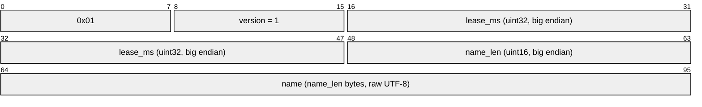
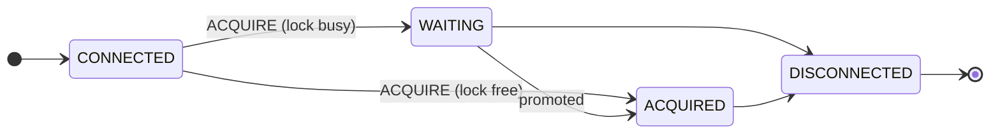

monolock uses a binary protocol, version 1, over raw TCP. One connection is
one claim on one named lock. The connection *is* the lease. When the
connection closes, the server releases the lock. All multi-byte integers are
**big endian**. TCP is a byte stream. Thus a client must read fixed-size
fields fully (`io.ReadFull` in Go). Do not assume that one read returns one
message.

The wire format is in
[`pkg/protocol`](https://github.com/monolock-dev/monolock/tree/main/pkg/protocol).
This is the one package that the server module exports. Clients in each
language implement the same bytes — see
[Writing a client](/clients/writing-a-client/).

## Messages

### Client to server

```text
ACQUIRE    [0x01][version uint8][lease_ms uint32][name_len uint16][name bytes]
HEARTBEAT  [0x02]
```

This is the `ACQUIRE` frame, byte by byte:



`ACQUIRE` must be the first message on a connection. It must occur exactly
one time. The server answers a second `ACQUIRE` with error `0x12`.

**`lease_ms`** is the lease that the client selects for this connection. The
server drops the session when the session is silent for this duration. The
value must be positive; the server answers `0` with error `0x17`. The value
stays constant for the life of the connection. There is no upper limit. The
hold time of a lock is unlimited in all cases. The lease only sets the
detection speed for a dead holder. Select the smallest value that is safe
against the network pauses between the client and the server: milliseconds
on the same machine, seconds across an unreliable WAN.

**Lock names** are raw UTF-8. They are case sensitive. The server does not
normalize them and does not trim them. The limit is **255 bytes**. This
limit is a part of the protocol, not a server setting. Thus each server
accepts each name that a client can build. The length field is wider than
the limit. Thus a longer name is possible on the wire, and the server
answers it with error `0x15`. An empty name causes error `0x14`. Invalid
UTF-8 causes error `0x16`.

**`HEARTBEAT`** is one byte. See [Heartbeats](#heartbeats) for the necessary
heartbeat schedule of the client.

### Server to client

```text
WAITING    [0x11]
ACQUIRED   [0x12][token uint64]
ERROR      [0x13][code uint8][reason_len uint8][reason bytes]
```

**`token`** is the [fencing token](/concepts/fencing-tokens/) of the grant.
Each `ACQUIRED` message that a session receives contains the token of its
grant. The first grant, a promotion, and a heartbeat acknowledgement all
contain the same token.

`WAITING` and `ACQUIRED` are also the heartbeat acknowledgement. There is no
separate `PING`, `PONG`, or `ACK` message. A reply gives four facts: the
heartbeat arrived, the session is registered, the return path operates, and
the client has the reported state. When the server promotes a waiter, the
server sends `ACQUIRED` **on its own initiative**. It does not wait for the
subsequent heartbeat. Thus a client needs a permanent reader on the
connection.

For `ERROR`, the **code** is the contract. The **reason** is a
human-readable UTF-8 string for error messages and debugging. It contains
the canonical text of the code, sometimes with more detail — "unknown
message type: 0x7f" — and it can be empty. Clients branch on the code only,
never on the text. The full code table with the retry rules is on
[Error codes](/reference/errors/).

## Session state machine



A connection moves through `CONNECTED → WAITING → ACQUIRED → DISCONNECTED`
or `CONNECTED → ACQUIRED → DISCONNECTED`. `ACQUIRED` never goes back to
`WAITING`. There is no `RELEASE` command. Close the connection, and the
server immediately promotes the next waiter. It is not necessary to wait for
the end of the lease.

## Heartbeats

The server stores `lastSeenAt` for each session. Each valid `ACQUIRE` or
`HEARTBEAT` refreshes this value. The server drops the session when the time
after `lastSeenAt` becomes more than the lease that the session requested.
Only durations go across the wire, never timestamps. Thus clock
synchronization is not necessary, and the two sides use only monotonic time.

The client calculates all other values from the lease that it selected:

```text
baseInterval  = lease / 4
clientTimeout = lease * 0.8      // always fires before the server lease
safeRTT       = smoothedRTT * 2  // EWMA, alpha = 0.2
interval      = clamp(baseInterval - safeRTT, minHeartbeatInterval, baseInterval)
```

RTT can only decrease the interval. A fast link never increases it above
`baseInterval`. If `safeRTT` is equal to or more than the full base
interval, the client sends the subsequent heartbeat immediately after the
answer to the previous one.

A maximum of one heartbeat is in flight at one time. Thus heartbeats cannot
collect in a TCP buffer, a stale message cannot extend a session, and
sequence IDs are not necessary. The client measures the interval between
sends, not as a pause after the reply.

[How it works](/concepts/how-it-works/#heartbeats) explains the reasons for
these rules. The rules are normative for each client implementation.

## Versioning

Each `ACQUIRE` contains the protocol version (currently `1`). A server that
does not support the requested version answers with error `0x10`. There is
no negotiation. A client speaks one version. The error is the signal for the
client to change to a version that the server supports, if the client has
one.
