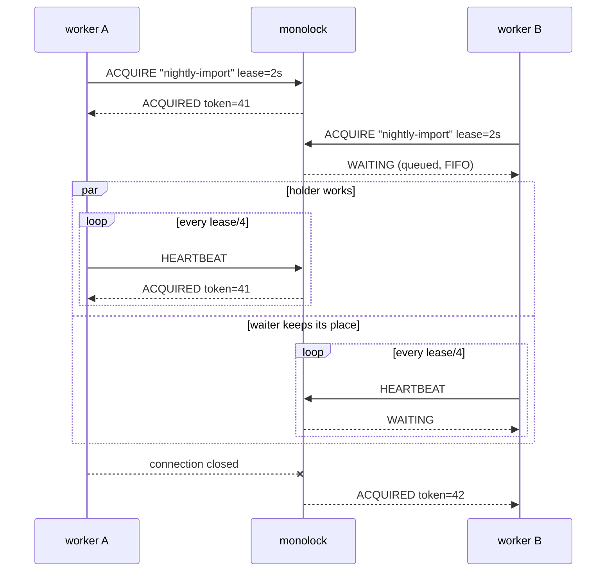

import { Tabs, TabItem, Steps, Aside, LinkCard, CardGrid } from '@astrojs/starlight/components';

<Steps>

1. **Start the server.**

   ```sh
   docker run -p 7070:7070 ghcr.io/monolock-dev/monolock
   ```

   This is a complete server in its production shape: no config file, no
   database, no dependencies. Each setting is a flag, and each flag has an
   equivalent environment variable. See
   [Configuration](/operations/configuration/).

2. **Acquire a lock from your code.**

   <Tabs syncKey="lang">
     <TabItem label="Go">
       ```sh
       go get github.com/monolock-dev/monolock-go
       ```

       ```go
       import (
           "context"
           "time"

           monolock "github.com/monolock-dev/monolock-go"
       )

       func main() {
           c := monolock.New(monolock.Config{Address: "127.0.0.1:7070"})

           // Blocks until this process owns "nightly-import", runs the
           // function, and releases the lock when it returns.
           err := c.Do(context.Background(), "nightly-import", 2*time.Second,
               func(ctx context.Context, token uint64) error {
                   // Only one process across your fleet runs this at a time.
                   // ctx is cancelled the moment ownership stops being
                   // confirmed; token fences out stale holders (see below).
                   return doTheWork(ctx, token)
               })
           if err != nil {
               // ...
           }
       }
       ```
     </TabItem>
     <TabItem label="Python">
       <Aside type="note" title="Coming soon">
         An official Python client does not exist yet. The
         [wire protocol](/reference/protocol/) is small and stable. See
         [Writing a client](/clients/writing-a-client/) if you want to write
         your own client today.
       </Aside>
     </TabItem>
     <TabItem label="Node.js">
       <Aside type="note" title="Coming soon">
         An official Node.js client does not exist yet. The
         [wire protocol](/reference/protocol/) is small and stable. See
         [Writing a client](/clients/writing-a-client/) if you want to write
         your own client today.
       </Aside>
     </TabItem>
     <TabItem label="Rust">
       <Aside type="note" title="Coming soon">
         An official Rust client does not exist yet. The
         [wire protocol](/reference/protocol/) is small and stable. See
         [Writing a client](/clients/writing-a-client/) if you want to write
         your own client today.
       </Aside>
     </TabItem>
   </Tabs>

3. **See the handover.**

   Run the program two times at the same time. The second process goes into
   the FIFO queue and prints nothing. When you stop the first process, the
   server promotes the second process *immediately*. There is no timeout to
   wait for. If you stop the first process with `kill -9`, the handover takes
   a maximum of the lease (2 seconds above). This is the failure-detection
   window that you selected in the call.

</Steps>

## What occurred



Each connection makes a claim on one named lock. The owner holds the lock
while its heartbeats continue to arrive. The waiter also sends heartbeats,
and thus it keeps its position in the queue. When the connection of the owner
closes in a controlled stop, the server promotes the subsequent waiter
immediately. When the owner stops silently, the server waits for the lease
*that the client selected*. Then the server moves the lock.

Examine the tokens: `41`, then `42`. Each grant contains a fencing token that
is strictly larger than each earlier token. Give the token to the resource
that your lock guards. The resource then rejects writes from a stale holder —
a holder that lost the lock and does not know it yet. This is the difference
between hope that mutual exclusion holds and enforcement by the resource.
Read [Fencing tokens](/concepts/fencing-tokens/).

## Next steps

<CardGrid>
  <LinkCard
    title="How it works"
    href="/concepts/how-it-works/"
    description="Leases, heartbeats, and handover in detail."
  />
  <LinkCard
    title="Deployment"
    href="/operations/deployment/"
    description="Docker, systemd, and Kubernetes manifests."
  />
  <LinkCard
    title="TLS & mTLS"
    href="/operations/tls/"
    description="Encrypt and authenticate before the traffic leaves localhost."
  />
</CardGrid>
