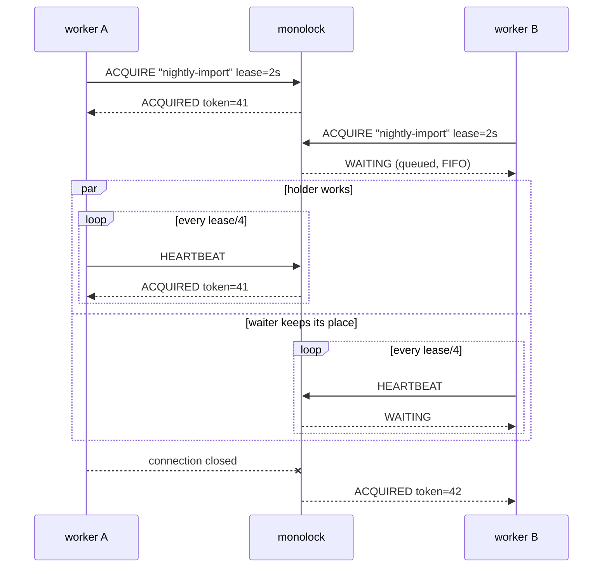

import { Tabs, TabItem, Steps, Aside } from '@astrojs/starlight/components';

<Steps>

1. **Start the server.**

   ```sh
   docker run -p 7070:7070 ghcr.io/monolock-dev/monolock
   ```

   That is a complete production-shaped server: no config file, no database,
   no dependencies. Every knob is a flag with a matching environment
   variable — see [Configuration](/operations/configuration/).

2. **Take a lock from your code.**

   <Tabs syncKey="lang">
     <TabItem label="Go">
       ```sh
       go get github.com/monolock-dev/monolock-go
       ```

       ```go
       import (
           "context"
           "time"

           monolock "github.com/monolock-dev/monolock-go"
       )

       func main() {
           c := monolock.New(monolock.Config{Address: "127.0.0.1:7070"})

           // Blocks until this process owns "nightly-import", runs the
           // function, and releases the lock when it returns.
           err := c.Do(context.Background(), "nightly-import", 2*time.Second,
               func(ctx context.Context, token uint64) error {
                   // Only one process across your fleet runs this at a time.
                   // ctx is cancelled the moment ownership stops being
                   // confirmed; token fences out stale holders (see below).
                   return doTheWork(ctx, token)
               })
           if err != nil {
               // ...
           }
       }
       ```
     </TabItem>
     <TabItem label="Python">
       <Aside type="note" title="Coming soon">
         An official Python client does not exist yet. The
         [wire protocol](/reference/protocol/) is small and stable — see
         [Writing a client](/clients/writing-a-client/) if you want to roll
         your own today.
       </Aside>
     </TabItem>
     <TabItem label="Node.js">
       <Aside type="note" title="Coming soon">
         An official Node.js client does not exist yet. The
         [wire protocol](/reference/protocol/) is small and stable — see
         [Writing a client](/clients/writing-a-client/) if you want to roll
         your own today.
       </Aside>
     </TabItem>
     <TabItem label="Rust">
       <Aside type="note" title="Coming soon">
         An official Rust client does not exist yet. The
         [wire protocol](/reference/protocol/) is small and stable — see
         [Writing a client](/clients/writing-a-client/) if you want to roll
         your own today.
       </Aside>
     </TabItem>
   </Tabs>

3. **Watch the handover.**

   Run the program twice at the same time. The second process queues up in
   FIFO order and prints nothing — until you stop the first one, at which
   point the second is promoted *immediately*, without waiting out any
   timeout. Kill the first one with `kill -9` instead and the handover takes
   at most the lease (2 seconds above): that is the failure-detection window
   you chose in the call.

</Steps>

## What just happened



Each connection claims one named lock. The owner holds it for as long as its
heartbeats keep arriving; the waiter heartbeats too, keeping its place in the
queue. When the owner's connection closes — a graceful exit — the next waiter
is promoted at once. When the owner dies silently, the server waits out the
lease *that client chose* and then moves on.

Note the tokens: `41`, then `42`. Every grant carries a fencing token strictly
larger than every earlier one. Hand it to the resource your lock guards and a
stale holder — one that lost the lock but doesn't know it yet — fences itself
out. That is the difference between hoping mutual exclusion holds and having
the resource enforce it: read [Fencing tokens](/concepts/fencing-tokens/).

## Next steps

- [How it works](/concepts/how-it-works/) — leases, heartbeats and handover in
  depth.
- [Deployment](/operations/deployment/) — Docker, systemd and Kubernetes
  manifests.
- [TLS & mTLS](/operations/tls/) — encrypt and authenticate before leaving
  localhost.
